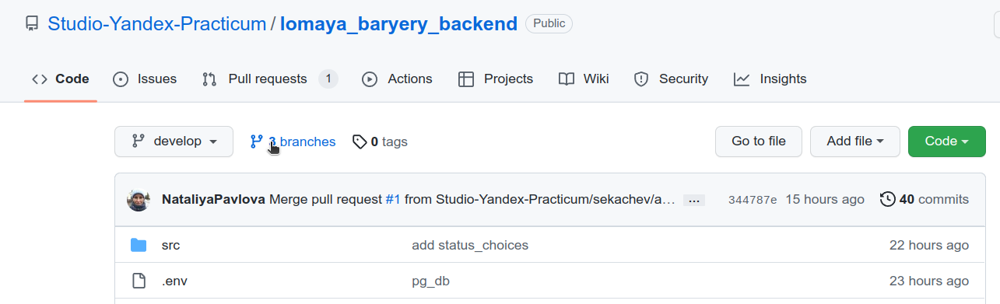
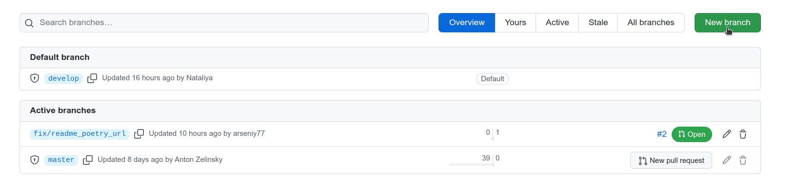
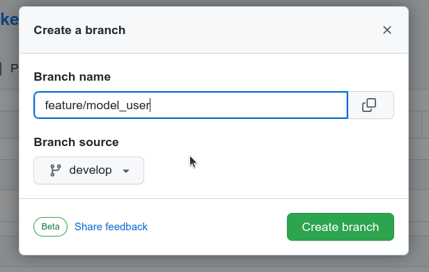
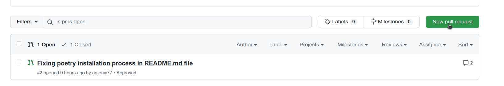
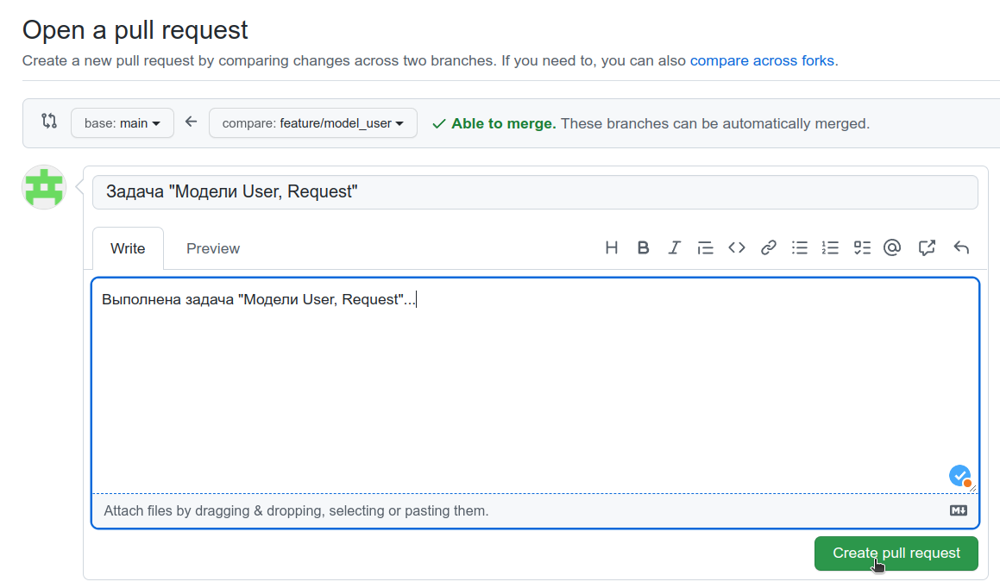

## Краткая инструкция по работе с git.

*Внимание! Для быстрого прохождения код-ревью, для снижения merge conflict придерживайтесь следующих правил:*
1. В коммит добавляйте только измененные файлы в которых решается только Ваша задача. 
2. Не добавляйте папки полностью, добавляйте файлы по отдельности.
3. Не изменяйте форматирование других файлов и не добавляйте их в коммит.
4. Если нашли ошибки в других файлах, то оставьте комментарий в PR. Не добавляйте исправленный файл в свой коммит. Эта ошибка будет исправлена автором или будет создана отдельная задача для её исправления.

### Порядок работы:

1. Если не копировали себе на компьютер репозиторий:
```
git clone git@github.com:Studio-Yandex-Practicum/lomaya_baryery_backend.git
```
 
Если нужно получить все изменения из главной ветки:
```
git pull origin develop
```

2. После получения задания создаём свою ветку на сайте.
Переходим на страницу со всеми ветками:


Нажимаем кнопку 'New branch':


Вводим название ветки. Название ветки должно быть такое: feature/{внятное название на англ} или fix/{внятное название на англ}. “Внятное название” - название, которое отвечает на вопрос “Что это”. Например, feature/model_user, или fix/readme. 


4. Получаем информацию о всех ветках:
```
git fetch
```

5. Переключаемся на эту ветку:
```
git checkout feature/model_user
```

6. Когда нужно отправить изменения на сайт:

Для устранения конфликтов, необходимо получить последнюю версию файлов с репозитория:
```
git pull origin develop
```

Смотрим какие файлы были изменены:
```
git status
```

Добавляем измененные файлы в коммит:
```
git add model.py service.py
```

Создаём новый коммит и отправляем на сервер:
```
git commit -m 'Commit description'
git push
```

7. Создаём pull request:
Переходим на страницу с pull requests:


Создаём новый pull request:


Заполняем информацию:

